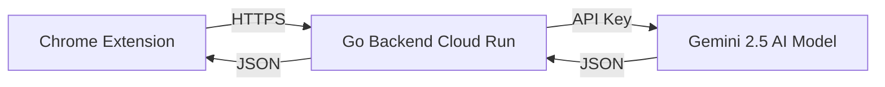

# 🧠 DeepBrief

[](LICENSE)
[](https://golang.org/)
[](https://deepmind.google/technologies/gemini/)
[](https://cloud.google.com/run)
[](https://developer.chrome.com/docs/extensions/)

> **"Like a university professor in your pocket."**

**DeepBrief** is a premium Chrome extension that transforms complex technical jargon into clear, multi-tiered explanations instantly. Powered by Google's state-of-the-art **Gemini 2.5 Flash Lite**, it delivers context-aware insights directly on any webpage.

---

## ✨ Luxury Features

| Feature | Description |
| :--- | :--- |
| **⚡ Instant Explanations** | Right-click any text to get an immediate AI breakdown. |
| **🧠 3-Mode Intelligence** | Switch between **Concise** (Dictionary), **Simple** (ELI5), and **Deep Dive** (Context). |
| **🎨 Glassmorphism UI** | A stunning, frosted-glass interface that feels native to modern OS aesthetics. |
| **📋 Smart Actions** | One-click copy, smooth transitions, and keyboard-accessible navigation. |
| **🔒 Enterprise Security** | API keys are proxy-shielded in a Go backend; no data is ever stored. |

---

## 🏗️ Architecture

A secure, decoupled architecture ensures speed, privacy, and scalability.



**Why this design?**
- **Security:** Client never sees the API key.
- **Speed:** Go backend on Cloud Run responds in milliseconds.
- **Privacy:** State-less request handling.

---

## 🛠️ Tech Stack

### 🖥️ Frontend (Extension)
- **Core:** 
- **Styling:** 
- **Isolation:** 
- **Framework:** 

### ☁️ Backend (API)
- **Language:** 
- **AI Model:** 
- **Infrastructure:** 
- **Container:** 

---

## 🚀 Status & Roadmap

The project is currently **Completed** and ready for production use.

- [x] **Phase 1:** Backend API Development
- [x] **Phase 2:** Cloud Deployment (Google Cloud Run)
- [x] **Phase 3:** Extension Core (Manifest V3)
- [x] **Phase 4:** Luxury UI Implementation (Tabs, Glassmorphism)
- [x] **Phase 5:** Final Polish & Documentation

---

## 📦 Installation (Local)

1.  **Clone the Repo:**
    ```bash
    git clone https://github.com/SoroushRF/DeepBrief.git
    cd DeepBrief
    ```

2.  **Run Backend:**
    ```bash
    cd backend
    cp .env.example .env # Add your GEMINI_API_KEY
    go run main.go
    ```

3.  **Load Extension:**
    - Go to `chrome://extensions/`
    - Enable **Developer Mode**
    - Click **Load Unpacked**
    - Select the `extension` folder

---

## 📝 License

Distributed under the **MIT License**. See `LICENSE` for more information.

---

## 👤 Author

**Soroush Raouf**
- GitHub: [@SoroushRF](https://github.com/SoroushRF)

---

<center>
  <i>Built with ❤️ using Go, Gemini AI, and pure Web Technologies</i>
</center>
